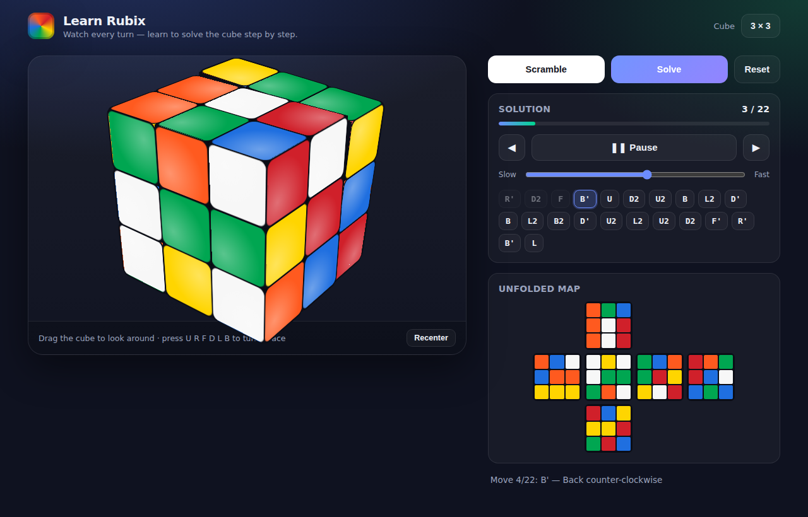

# Learn Rubix 🧊

A tiny, modern web app for **learning to solve the Rubik's cube**. Scramble the
cube — or **scan your own real cube from photos** — then watch it solve itself one
animated, labelled turn at a time, at your own pace.



## Features

- **Animated 3D cube** rendered with pure CSS 3D transforms — no libraries, works
  fully offline. Drag to rotate and look at any face.
- **Solve from a photo** 📷 — a single photo can only show three faces, so the
  fastest capture is a **two-corner quick scan**: shoot one corner (top/front/right)
  and the opposite corner (down/left/back), drag the frame onto each cube, and it
  reads all six faces. You can also photograph faces one at a time or paint the
  stickers. Colours are auto-detected as an assist — **always verify them** (the
  app refuses to solve an impossible cube) — then it reconstructs your exact cube
  in 3D and teaches you how to solve *that* cube.
- **Real step-by-step method** — 3×3 cubes are solved with the layer-by-layer
  beginner method, split into readable phases you can learn:
  *Bottom cross → Bottom corners → Middle layer → Top cross → Orient top corners →
  Place top corners → Finish top edges.*
- **Your pace** — step through manually with Prev / Next, or auto-play every
  0.9–3.2 seconds per move. Click any move in the list to jump to it.
- **Configurable size** — 2×2, 3×3, 4×4 and 5×5.
- **Live 2D unfolded map** that stays in sync with the 3D cube, plus keyboard
  turns (`U R F D L B`, `Shift` = counter-clockwise) to practise the notation.

## How it works

Every cubie is a single physical object carrying an integer position and an
integer orientation matrix. That *same* model drives the solver logic and the 3D
renderer, so they can never drift out of sync.

- **Photo → cube.** Each scanned face gives nine sticker colours (classified from
  the photo in HSV, then confirmed/corrected by you). The 54 stickers are validated
  and reconstructed into the exact physical cube, which is then displayed and solved.
- **The solver.** 3×3 cubes are solved from *any* valid state with a real
  layer-by-layer method: the bottom cross is found optimally from a precomputed
  distance table, and every later step simulates a small set of candidate
  maneuvers and keeps only ones that provably make progress while preserving the
  pieces already solved. This is verified over thousands of random states (see
  the tests). Other sizes are solved by inverting the recorded move history.

## Run it

Modern browsers block ES modules over `file://`, so serve the folder over http:

```bash
npm start          # serves at http://localhost:8000
# or: python3 -m http.server 8000
```

Then open <http://localhost:8000>.

## Tests

```bash
npm test
```

- **moves** — every turn is a real face turn (`move⁴ = identity`, inverses, the
  "sexy move" identity, standard `U`/`R`/`F` behaviour).
- **solver** — history-inverse solves round-trip for every size.
- **lbl** — 800 random 3×3 states all solve back to solved (run
  `LBL_TRIALS=5000 node test/lbl.test.mjs` for a heavier pass).
- **reconstruct** — reading a cube's stickers and rebuilding it round-trips exactly
  and stays solvable; invalid sticker sets are rejected.

## Project layout

```
index.html        markup + layout + scan modal
styles.css        modern dark UI
js/cube.js        physical model, moves, scramble, net, reconstruction
js/lbl.js         layer-by-layer 3x3 solver (any state) + cross BFS table
js/solver.js      solve dispatcher
js/renderer.js    CSS-3D rendering + animated face turns
js/scan.js        photo → sticker-colour detection
js/app.js         UI, playback, pace, scan modal, keyboard
serve.mjs         tiny static server
test/             node test suite
```

## Controls

| Action | How |
| --- | --- |
| Rotate the view | drag the cube |
| Turn a face | press `U R F D L B` (`Shift` = counter-clockwise) |
| Solve your own cube | **Solve from a photo of your cube** → scan / paint → Build & Solve |
| Play / pause | **Play** button or `Space` |
| Step through | **◀ Prev / Next ▶**, arrow keys, or click a move chip |
| Playback pace | the **Pace** dropdown (Manual, or 0.9–3.2 s per move) |
| Change size | the **Cube** dropdown |
